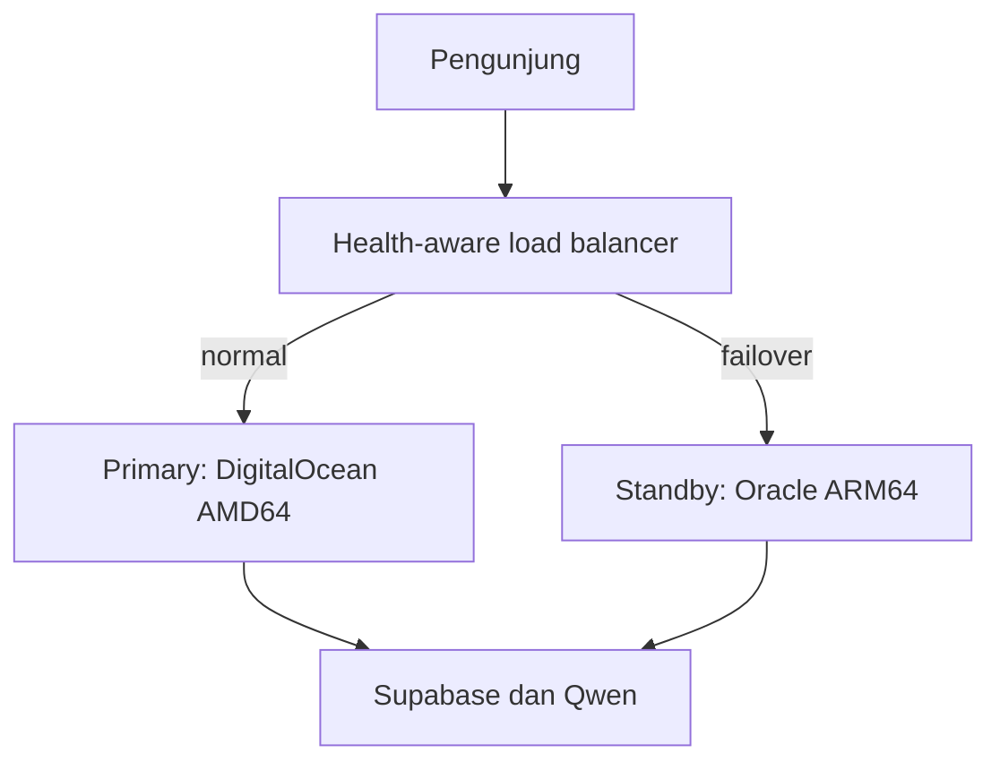

# Dua server produksi: primary dan standby

Dua server tidak menghasilkan 48 jam dalam satu hari. Keduanya berjalan 24/7 pada waktu yang sama. Tujuannya adalah menjaga layanan tetap tersedia ketika salah satu penyedia bermasalah.

## Susunan yang dipakai



- Primary: DigitalOcean, Ubuntu 24.04, minimal 2 GB RAM, IPv4 publik.
- Standby: Oracle Cloud Always Free `VM.Standard.A1.Flex`, Ubuntu 24.04 ARM64, 1 OCPU dan 6 GB RAM disarankan.
- State bersama: Supabase. Tidak ada database lokal yang perlu direplikasi antarkedua VPS.
- Image GHCR dibangun untuk `linux/amd64` dan `linux/arm64`.
- Rilis dikirim ke standby terlebih dahulu. Primary hanya diperbarui setelah health check standby lulus.
- Setiap VPS mempertahankan rollback lokal ke image sehat sebelumnya.

Oracle membatasi total Always Free A1 menjadi 2 OCPU dan 12 GB RAM serta dapat menarik instance yang dianggap idle. Ketersediaan kapasitas juga tidak selalu ada. Karena itu Oracle digunakan sebagai standby, bukan satu-satunya produksi.

## Fase 1: hidupkan dua origin secara terpisah

Buat record DNS sementara:

| Hostname | Tujuan |
|---|---|
| `primary.ngeblogging.com` | IPv4 DigitalOcean |
| `standby.ngeblogging.com` | IPv4 Oracle |

Jalankan `scripts/bootstrap-ubuntu.sh deploy` pada kedua server dan isi `/opt/ngeblogging/shared/.env` yang sama. Jangan menyalin file tersebut melalui repository atau screenshot.

Tambahkan GitHub Actions variables:

| Nama | Nilai |
|---|---|
| `PRODUCTION_DEPLOY_ENABLED` | `true` setelah kedua server siap |
| `DUAL_SERVER_DEPLOY_ENABLED` | `true` |
| `PRIMARY_VPS_PORT` | `22` |
| `STANDBY_VPS_PORT` | `22` |
| `PRIMARY_SITE_HOSTS` | `primary.ngeblogging.com` |
| `PRIMARY_SITE_DOMAIN` | `primary.ngeblogging.com` |
| `STANDBY_SITE_HOSTS` | `standby.ngeblogging.com` |
| `STANDBY_SITE_DOMAIN` | `standby.ngeblogging.com` |

Tambahkan secrets berikut. Setiap server sebaiknya mempunyai key SSH deployment yang berbeda.

| Primary | Standby |
|---|---|
| `PRIMARY_VPS_HOST` | `STANDBY_VPS_HOST` |
| `PRIMARY_VPS_USER` | `STANDBY_VPS_USER` |
| `PRIMARY_VPS_SSH_PRIVATE_KEY` | `STANDBY_VPS_SSH_PRIVATE_KEY` |
| `PRIMARY_VPS_SSH_KNOWN_HOSTS` | `STANDBY_VPS_SSH_KNOWN_HOSTS` |

Setelah workflow berhasil, verifikasi keduanya:

```bash
bash scripts/verify-production.sh primary.ngeblogging.com
bash scripts/verify-production.sh standby.ngeblogging.com
```

Uji login, logout, Nara, unggahan, refresh route, dan tampilan HP pada masing-masing origin. Pantau 24–48 jam sebelum domain utama dipindahkan.

## Fase 2: failover otomatis

Menjalankan dua VPS tidak otomatis memindahkan pengunjung. Failover yang benar memerlukan layanan di depan kedua server yang secara berkala memeriksa `/api/health`.

Cloudflare Load Balancing mendukung pola active-passive, tetapi merupakan add-on berbayar. Migrasikan DNS ke Cloudflare hanya setelah semua record Netlify DNS disalin dan kedua origin sehat.

Konfigurasi yang diperlukan:

1. Buat pool `ngeblogging-primary` dengan endpoint IPv4 DigitalOcean.
2. Tambahkan Host header endpoint `primary.ngeblogging.com`.
3. Buat pool `ngeblogging-standby` dengan endpoint IPv4 Oracle.
4. Tambahkan Host header endpoint `standby.ngeblogging.com`.
5. Buat HTTPS monitor untuk path `/api/health`, expected status `200`, dan expected body `"status":"ok"`.
6. Buat load balancer untuk `ngeblogging.com`; urutkan primary lalu standby dan set Traffic Steering `Off`.
7. Ulangi untuk `www.ngeblogging.com` atau arahkan `www` secara kanonis ke apex.
8. Biarkan record origin `primary` dan `standby` sebagai DNS-only agar monitor tidak berputar kembali ke Cloudflare.
9. Aktifkan notifikasi penggunaan dan batas tagihan Cloudflare.

Host header per endpoint penting agar Caddy memilih virtual host serta sertifikat TLS yang cocok untuk masing-masing origin.

## Urutan aman saat aktivasi

1. Netlify tetap melayani domain utama.
2. Kedua VPS berjalan pada hostname origin masing-masing.
3. Kedua origin lulus pengujian selama 24–48 jam.
4. Salin seluruh DNS record ke Cloudflare, termasuk record email jika ada.
5. Aktifkan load balancer dan uji failover dengan menghentikan container web primary selama beberapa menit.
6. Hidupkan kembali primary dan pastikan traffic kembali normal.
7. Baru hentikan build otomatis Netlify; jangan hapus alamat cadangan sebelum masa observasi selesai.

Tidak ada rancangan yang dapat menjamin nol kendala. Dua penyedia mengurangi risiko kegagalan VPS, tetapi Supabase, Qwen, GitHub, DNS, dan konfigurasi pengguna tetap dapat menjadi titik kegagalan.
