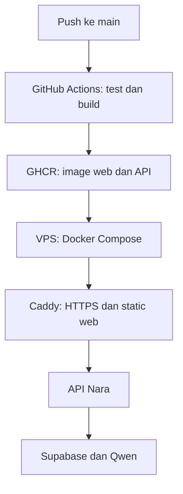

# Menjalankan Ngeblogging di server produksi

Paket ini memindahkan frontend dan API Nara dari kredit deployment Netlify ke VPS. Supabase tetap menjadi database dan penyedia autentikasi; Alibaba Cloud tetap menjadi penyedia model Nara. Netlify dapat dipertahankan sebagai alamat cadangan selama migrasi. Untuk DigitalOcean primary + Oracle ARM64 standby, lanjutkan ke [`DUAL_SERVER.md`](DUAL_SERVER.md).

## Arsitektur



- Build frontend berlangsung di GitHub Actions, bukan di VPS.
- Caddy menyajikan aset Vite, mengompresi respons, menerbitkan HTTPS, dan meneruskan `/api/*` ke container API.
- API Nara berjalan sebagai user non-root, tidak membuka port ke internet, dan tetap memakai logika kuota Supabase yang sama dengan Netlify Function.
- Image memiliki tag commit seperti `sha-030c...`; deployment gagal otomatis kembali ke tag sebelumnya.

## Prasyarat

- VPS Ubuntu 24.04 LTS atau Debian 12.
- Minimum 1 vCPU, RAM 1 GB, SSD 20 GB; RAM 2 GB lebih nyaman.
- IPv4 publik tetap.
- Firewall penyedia VPS membuka TCP `22`, `80`, `443` dan opsional UDP `443` untuk HTTP/3.
- Domain tetap dikelola melalui Netlify DNS. Nameserver tidak perlu dipindahkan.
- Akses admin repository GitHub `triapriyogibahari7-pixel/ngeblogging`.

Jangan membuat record `AAAA` sebelum VPS benar-benar mempunyai IPv6 publik yang berfungsi.

## 1. Buat user deployment dan pasang Docker

Masuk pertama kali ke VPS sebagai root, buat user non-root, lalu pasang public key SSH:

```bash
adduser deploy
usermod -aG sudo deploy
install -d -m 700 -o deploy -g deploy /home/deploy/.ssh
```

Salin public key Anda ke `/home/deploy/.ssh/authorized_keys`, atur mode `600`, lalu dari salinan repository jalankan:

```bash
sudo bash scripts/bootstrap-ubuntu.sh deploy
```

Script mengikuti repository paket resmi Docker, mengaktifkan Docker saat boot, menambahkan user `deploy` ke group Docker, dan membuat direktori `/opt/ngeblogging`. Logout lalu login lagi setelah script selesai.

Docker memberi hak setara root kepada anggota group `docker`. Gunakan user ini hanya untuk deployment dan lindungi private key-nya.

## 2. Isi environment server

Buat `/opt/ngeblogging/shared/.env` langsung di VPS dengan mode `600`. Isi minimum:

```dotenv
SUPABASE_URL=https://PROJECT_REF.supabase.co
SUPABASE_PUBLISHABLE_KEY=sb_publishable_REPLACE_ME
PUBLIC_SITE_URL=https://ngeblogging.com
PUBLIC_ALLOWED_ORIGINS=https://ngeblogging.com,https://www.ngeblogging.com,https://staging.ngeblogging.com

QWEN_API_KEY=REPLACE_ME
QWEN_WORKSPACE_ID=REPLACE_ME
QWEN_REGION=singapore
QWEN_API_BASE_URL=

QWEN_MODEL=qwen3.6-flash
NARA_MODEL_MINI=qwen3.6-flash
NARA_MODEL_WRITER=qwen3.7-plus
NARA_MODEL_VISION=qwen3-vl-plus
NARA_MODEL_MAX=qwen3.7-max

HOST=0.0.0.0
PORT=3000
TRUST_PROXY=1
MAX_REQUEST_BYTES=20971520
RATE_LIMIT_PER_MINUTE=20
NARA_RUNTIME=portable-api-v1
```

Lalu:

```bash
chmod 600 /opt/ngeblogging/shared/.env
```

Gunakan **publishable key**, bukan `service_role` atau Supabase secret key. `QWEN_API_KEY` hanya berada di file server ini, bukan di repository atau image.

## 3. Atur GitHub Actions

Buka repository → **Settings → Secrets and variables → Actions**.

### Repository variables

| Nama | Nilai awal staging | Nilai produksi |
|---|---|---|
| `VITE_SUPABASE_URL` | URL proyek Supabase | sama |
| `VITE_PUBLIC_SITE_URL` | `https://ngeblogging.com` | sama |
| `PRODUCTION_DEPLOY_ENABLED` | `false` | `true` setelah server siap |
| `DUAL_SERVER_DEPLOY_ENABLED` | `false` | `true` hanya setelah standby siap |
| `VPS_PORT` | `22` | sesuai port SSH |
| `SITE_HOSTS` | `staging.ngeblogging.com` | `ngeblogging.com, www.ngeblogging.com` |
| `PRIMARY_SITE_DOMAIN` | `staging.ngeblogging.com` | `ngeblogging.com` |
| `ACME_EMAIL` | email admin domain | sama |

### Repository secrets

| Nama | Isi |
|---|---|
| `VITE_SUPABASE_PUBLISHABLE_KEY` | publishable key Supabase; aman untuk browser, tetapi disimpan sebagai secret agar tidak tercetak di workflow |
| `PRIMARY_VPS_HOST` | IPv4 atau hostname VPS utama; nama lama `VPS_HOST` tetap didukung |
| `PRIMARY_VPS_USER` | `deploy`; nama lama `VPS_USER` tetap didukung |
| `PRIMARY_VPS_SSH_PRIVATE_KEY` | private key khusus deployment tanpa passphrase interaktif |
| `PRIMARY_VPS_SSH_KNOWN_HOSTS` | baris host key VPS yang sudah diverifikasi |

Buat key deployment terpisah:

```bash
ssh-keygen -t ed25519 -C ngeblogging-production -f ~/.ssh/ngeblogging-production
```

Tambahkan file `.pub` ke `authorized_keys` user `deploy`. Ambil known hosts dari perangkat tepercaya dan cocokkan fingerprint dengan console VPS:

```bash
ssh-keyscan -p 22 IP_VPS
ssh-keygen -lf /etc/ssh/ssh_host_ed25519_key.pub
```

Jangan menggunakan screenshot untuk private key, API key, atau Client Secret.

## 4. Uji dengan subdomain staging

Di **Netlify → Domains → ngeblogging.com → DNS records**:

1. Tambahkan record `A` dengan nama `staging` dan nilai IPv4 VPS.
2. Jangan ubah record apex `ngeblogging.com` dahulu.
3. Di Supabase **Authentication → URL Configuration**, tambahkan redirect staging yang dipakai aplikasi, setidaknya `https://staging.ngeblogging.com/**` selama pengujian.
4. Set `SITE_HOSTS=staging.ngeblogging.com`, `PRIMARY_SITE_DOMAIN=staging.ngeblogging.com`, dan `PRODUCTION_DEPLOY_ENABLED=true` di GitHub variables.
5. Buka **Actions → Production images and deploy → Run workflow**.

Caddy menerbitkan sertifikat otomatis setelah DNS staging mencapai VPS dan port 80/443 dapat diakses.

Uji:

```bash
bash scripts/verify-production.sh staging.ngeblogging.com
```

Checklist wajib:

- Landing page dan Studio tampil pada desktop serta HP.
- Login email, Google, GitHub, dan LinkedIn kembali ke staging.
- Logout, reset password, dan pemulihan sesi berjalan.
- `GET /api/health` mengembalikan `status: ok`.
- `GET /api/nara` menampilkan `ready: true` tanpa secret.
- Pertanyaan Nara tamu serta pengguna login bekerja dan kuotanya berkurang.
- Refresh pada route SPA tidak menghasilkan 404.

## 5. Pindahkan domain utama

Hanya setelah staging lulus:

1. Pastikan Supabase Site URL adalah `https://ngeblogging.com` dan redirect produksi masih diizinkan.
2. Ubah GitHub variables menjadi:

   ```text
   SITE_HOSTS=ngeblogging.com, www.ngeblogging.com
   PRIMARY_SITE_DOMAIN=ngeblogging.com
   ```

3. Jalankan workflow sekali agar Caddy siap menerima domain utama.
4. Di Netlify DNS, ganti record khusus apex/`www` yang bertipe `NETLIFY` dan `NETLIFYv6`:
   - `A` apex/`@` → IPv4 VPS.
   - `CNAME` `www` → `ngeblogging.com`.
   - Hapus record `AAAA`/`NETLIFYv6` untuk apex dan `www` jika VPS tidak memiliki IPv6.
5. Jangan mengubah empat nameserver `dns1–dns4.p07.nsone.net`; Netlify tetap menjadi pengelola DNS saja.
6. Tunggu DNS, lalu jalankan:

   ```bash
   bash scripts/verify-production.sh ngeblogging.com
   ```

7. Pantau selama 24–48 jam. Alamat `ngeblogging.netlify.app` dapat tetap menjadi cadangan.

## 6. Menghentikan pemakaian kredit deploy Netlify

Setelah VPS stabil, putuskan koneksi build otomatis repository dari site Netlify atau pause build Netlify. Jangan hapus DNS zone selama nameserver domain masih menunjuk Netlify DNS. Memindahkan web ke VPS tidak mengharuskan memindahkan DNS.

## Referensi resmi

- [Install Docker Engine di Ubuntu](https://docs.docker.com/engine/install/ubuntu/)
- [Docker Compose untuk produksi](https://docs.docker.com/compose/how-tos/production/)
- [Caddy Automatic HTTPS](https://caddyserver.com/docs/automatic-https)
- [GitHub Actions untuk menerbitkan Docker image](https://docs.github.com/en/actions/tutorials/publish-packages/publish-docker-images)
- [Supabase Auth Redirect URLs](https://supabase.com/docs/guides/auth/redirect-urls)
